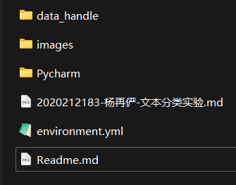
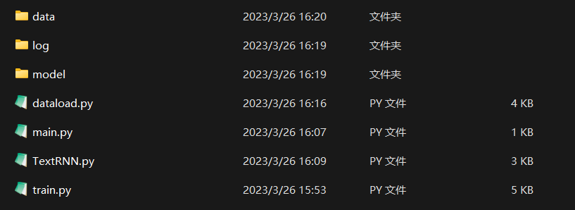
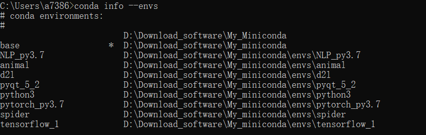
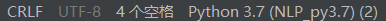
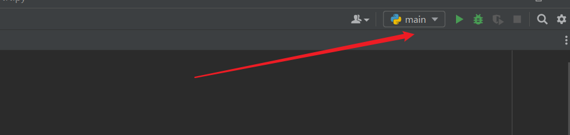
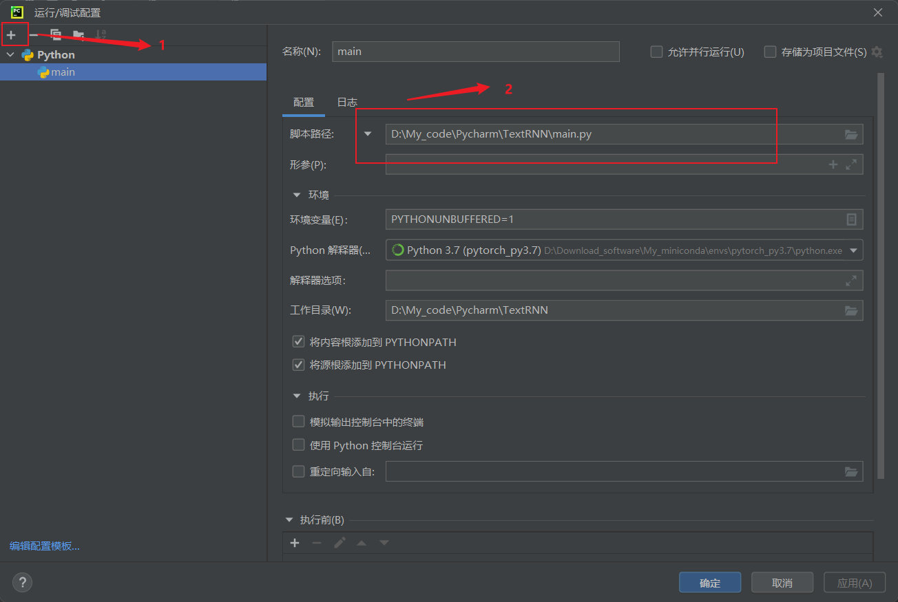

## 1.实验任务

内容：基于给定的中文语料库，利用RNN（循环神经网络）模型，编程实现中文气象灾情文本的分类（暴雨洪涝、冰雹、城市内涝、大风、干旱、雷电、台风共计7个类别）

完成目标：
（1）了解文本分类的流程和RNN的基本用法
（2）了解训练/验证/测试的数据集分割以及超参数调整
注意：可以尝试一些优化项，比如不同的损失函数或者正则化等等。

作业要求：
（1）提交实验报告，以学号-姓名-XXX实验命名：实验报告应包括数据集情况、模型介绍、超参调整、实验结果分析等内容。
（2）提交源代码：源代码请附加Readme文件说明使用的主要包的版本，以及其他可能影响代码运行的事项。

参考资料：

- 新闻分类综述：[干货 | 日采100W新闻数据，如何实现新闻自动分类 (qq.com)](https://mp.weixin.qq.com/s/1PkRgJJ_bK5F9wZ3LK2uxQ)；

- 基本操作：[44. RNN网络架构解读_哔哩哔哩_bilibili](https://www.bilibili.com/video/BV1kP411u7WL?p=1&vd_source=276d55048634a5b508b1b53a1ecd56b3)+配到解读[NLP自然语言处理-新浪新闻文本分类（CNN、RNN、Transformer）笔记 - 知乎 (zhihu.com)](https://zhuanlan.zhihu.com/p/526376136)；

## 2.实验环境

在目录下有一个environment.yml文件用于记录所有的依赖包和精确的版本号以便部署环境，通过

```shell
conda env create -n simclr -f environment.yml
```

命令回车进行安装，本项目的依赖包和版本号部分如下，也可以手动使用`conda install`命令安装

```txt
pytorch==1.12.0 
torchvision==0.13.0 
torchaudio==0.12.0 cpuonly
tensorflow==2.11.0
tensorboardX==2.6
skicit-learn==1.0.2
tqdm==4.65.0
textrank4zh==0.3
snownlp==0.12.3
jieba==0.42.1
numpy==1.21.5
pandas==1.3.5
```

## 3.实验说明

### 3.1 实验目录说明

实验目录结构如下：



- data_handle是notebook的一系列文件，用于处理原始语料生成训练数据、验证数据和测试数据
- images是md文档的图片存储路径
- Pycharm中包含此次实验的项目代码（本地运行很慢，可以利用Kaggle训练这个目录中的文档）
- 第三个md文档是本次实验的实验报告
- environment.yml是环境配置文件，用于conda配置虚拟环境
- Readme文档简单介绍了本实验内容

Pycharm目录中包含以下内容



- data目录包含本次训练使用的训练集数据、测试集数据以及验证集数据，还有预训练的词向量模型以及字索引表
- log用于保存每次训练过程中的参数变化，用于tensorboard可视化
- model用于保存训练模型
- dataload.py是数据加载模块
- main.py是主文件，用于启动项目
- TextRNN.py是网络模块，用于搭建RNN网络模型
- train.py是训练模块，用于定义网络训练和测试

### 3.2 使用说明

本次实验使用的miniconda来搭建实验虚拟环境，常用conda命令操作主要有：
-查看常用conda命令：conda help
-查看conda版本：用户根目录下使用 conda --version ；
-查看所有的conda环境：用户根目录下直接使用 conda info --env 即可；
-激活某个conda环境：用户根目录下直接使用 conda activate [conda环境名] ；
-查看某个环境下安装的所有包：激活conda环境后使用 pip list ；
-关闭某个conda环境：使用 conda deactivate 退出；
-新建conda环境(name为d2l，python版本为3.8，-y参数能直接跳过安装的确认过程)：使用 conda create --name d2l python=3.8 -y
-安装需要的包(如版本为2.8.0的tensorflow)：激活对应环境后，使用命令 pip install tensorflow==2.8.0
-进入jupyter：激活对应环境后，使用cd进入磁盘某个目录，接着使用 jupyter notebook进入notebook

打开cmd输入`conda info --env`可以查看当前存在的python虚拟环境



如何创建虚拟环境并配置pycharm参考[(13条消息) 如何在pycharm中配置anaconda的虚拟环境_pycharm怎么配置anaconda环境_肆十二的博客-CSDN博客](https://blog.csdn.net/ECHOSON/article/details/117220445)，配置成功后pycharm右下角如图所示



进入pycharm后需要配置运行/调试参数，主要是选择主文件的脚本路径






之后点击“运行”即可构建并运行项目；


