# 一、背景

在进行个性化新闻推荐之前，有一个非常重要的步骤就是对新闻内容进行分类；

新闻行业发展之初，分类是由人工处理的，但伴随着互联网和计算机行业的发展，人工处理局限性开始显露：

- 数据量激增：新闻数据来源众多，可能一分钟就有成千上万条新的数据产生；

- 人工成本高：数据量激增的情况下，需要付出更多的人力成本；

- 分类效率低：新闻数据时效性要求高，人工处理速度慢，效率低下；

使用计算机可以很好的避免这些问题，下面将讨论如何利用计算机技术来实现新闻数据的自动分类；

### 1.1 发展历程

文本分类技术发展的历程主要分为如下四个阶段

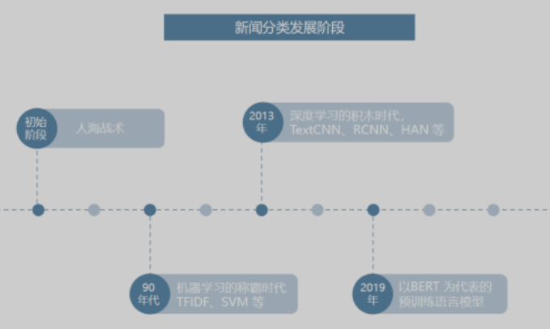

初始阶段新闻数据有限，计算机也未大范围使用，因此这个阶段均为人海战术，即使用人工对新闻进行分类；

90年代开始，伴随着互联网的发展，数据的体量快速积累，同时获取难度显著降低，以及计算机性能的快速提升，统计机器学习进入了一个快速发展的时代。此时的自然语言处理从语言学领域逐渐过度成为一个交叉学科，并且其中的统计数学占比越来越高，早期的一些算法如 TF-IDF 等开始展现出更大的价值；

近 10 年以来，随着 GPU 运算带来的并行算力提升，`深度学习`得到了长足发展，诸如 LSTM 在内的一批早在 90 年代提出的网络结构被广泛采用，在不少领域取得了`统计机器学习`所无法企及的效果。此时以CNN和RNN为基础的大量神经网络模型的提出快速丰富了深度学习在各场景下的应用，如LSTM、TextCNN、RCNN、HAN 等；

近两年，以 BERT 为首的一批基于 Transformer 的预训练语言模型开始逐步占领自然语言处理的主流，其主要目的在于`充分利用海量的无标注文本数据学习语言的基本规律`，在各场景中实现使用少量的标注数据就可以得到更好的效果；

### 1.2 特征工程

获取新闻数据后，在对数据进行分类之前还需要进行特征工程，即依次经过数据清洗、特征筛选和特征向量化三个环节；

- 数据清洗：过滤和筛除一些与新闻无关的符号或特殊字段，去除重复内容，提升文本质量，减轻系统负荷；

- 特征筛选：根据业务需求，针对性地对关键词、新闻标题、新闻首尾段落等文本进行提取；

- 特征向量化：将每篇新闻的特征汇总为一个固定长度的向量，以便分类算法进行运算；

由于新闻的文本内容较长，直接使用全文作为任务的输入难以实现较好的分类效果，数据清洗和特征筛选是自然语言处理任务中常规的预处理流程（目前而言NLP的模型和算法选择相对有限，因此数据预处理成为关键因素，这一点在之后实际模型的训练过程中也会体现）；

#### 1.2.1 数据清洗

数据清洗主要用于提升文本质量，统一和对齐各个数据渠道的文本格式（有利于之后的特征筛选等步骤），具体而言其内容包括：

- 滤除或统一替换特殊符号，如 html 标签，emoji 表情等；

- 去除与新闻类别无关的特殊前缀、小尾巴等文本（如网站名）；

- 去重，减少运算量，同时避免重复文本影响聚类算法的聚类中心，对于海量长文本的去重可以参考 SimHash算法；

除了清洗无意义的文本数据以外，一般的文本分类流程中还需要进行分词和去除停用词等操作（具体还是要根据具体任务进行选择，不是所有的任务都需要分词和去除停用词的，如果得到的语料库非常干净可以完全不需要这些处理）：

- 分词：由于中文不像英文那样具有天然的分隔符，所以一般情况下，中文自然语言处理的第一步就是要对语料进行分词处理；
- 去除停用词：停用词（Stop Words）经常出现在文档中，却没有具体的实际意义。在中文文档中如“啊”、“在”、“的”之类。这些词也可称作虚词，包含副词、冠词、代词等，在文档中使用十分广泛，但却难以对文档分类提供帮助。因此，在研究文本分类等数据挖掘问题时，经常会将它们预先剔除，既可以减少存储空间、降低计算成本，又可以防止它们干扰分类器的性能；

#### 1.2.2 特征筛选

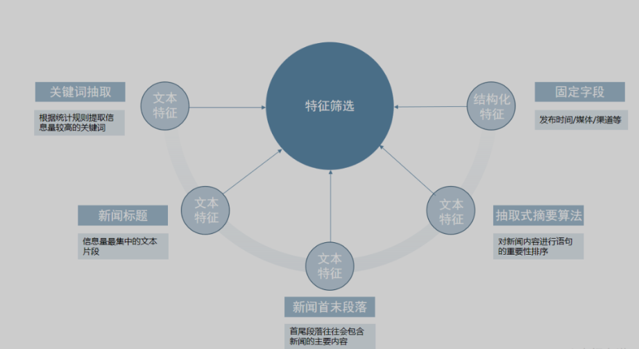

特征筛选则是根据业务需求，针对性地对特定内容进行提取，以得到后续模型或算法聚焦与关注的特征（比如之后的RNN文本分类聚焦的就是新闻标题），对于新闻数据，通常可以分为以下几种：

- 文本特征
  - 关键词抽取：根据统计规则提取信息量较高的若干关键词，常用的实现可以参考
    - 基于 TextRank 的关键词提取
    - 基于 TF-IDF 的关键词提取
  - 新闻标题：新闻标题是信息量最集中的文本片段，大多数新闻分类都会使用到该信息；
  - 新闻的首尾段落：因为新闻的成文较为规范，首尾段落往往会包含新闻的主要内容，但是需要注意某些网站的首尾段落可能包含一些固定模板，在前置数据清洗流程中要注意进行相应的处理；
  - 抽取式摘要算法：抽取式摘要算法可以理解为对新闻内容进行语句的重要性排序，从文章中抽出一些重要的句子，从而代表整篇文章的主要内容，语句的重要性排序同样是基于上述的关键词抽取、新闻标题、新闻的首末段落等步骤来实现的；
- 结构化特征（非文本）：
  - 发布时间: 发布时间是判断新闻归属分类的重要参考依据；
  - 发布媒体、渠道等

#### 1.2.3 特征向量化

经过数据清洗和特征筛选对每篇新闻处理后，得到了其最具代表性的`文本特征`和`结构化特征`，这部分特征的质量可以通过简单的人工验证来进行有效性判断，即人可以在不阅读原文的情况下，仅通过这部分特征判断出该新闻的归属类别；

直接将上述特征文本应用于运算还不行，因为系统进行运算需要数值类型的结构化数据，因此需要将特征文本转换为数值结构化向量，使用固定长度的数值向量来表示；

因此特征向量化的工作就是将每篇新闻的特征汇总为一个固定长度的向量，便于分类算法进行运算 -- 这个过程被称为embedding；

如果特征工程实施得当，那么在特征空间中，两个特征向量的坐标越接近，意味着两个特征向量的内容相似度越高，越可能属于同个分类；

> 文本特征向量化 -- 词向量

词向量是自然语言处理中的一项基础工作，通过一个简单的神经网络训练得到，这个训练任务在训练中让拥有类似用法（上下文语境）的词对应相近的向量，进而使用这些向量来表征对应的字或词。这种做法基于语言学中的“情景语境”理论，该理论认为一个词的语义与其上下文语境是紧密关联的。常用的词向量类型有 Word2Vec，GloVe 等，根据不同的任务其性能略有差异；

文本特征向量化也称为文本编码，表示词向量将文本统一成为可以进行计算的一个语义特征向量，以下两种方式可以将文本编码拓展得到文本段落的编码；

- 字、词向量求和编码：简称词向量，对于短句（如新闻标题）或关键词特征，我们可以直接使用字、词向量进行求和，整合多个字、词的特征向量；
- 模型编码：对于较长的文本，逐字（词）将词向量输入模型（如 Bi-LSTM, TextCNN 等），辅以注意力机制，可以更好的为输入的字词分配合理的权重，进而更好的保留长文本的主要特征；

> 非文本特征

非文本特征的向量化通常比较简单，如果需要输入模型进行计算，可以直接将数值化表示的特征拼接至文本特征向量；否则也可以不与文本特征向量进行整合，而是通过其他后续逻辑进行处理；

### 1.3 新闻分类

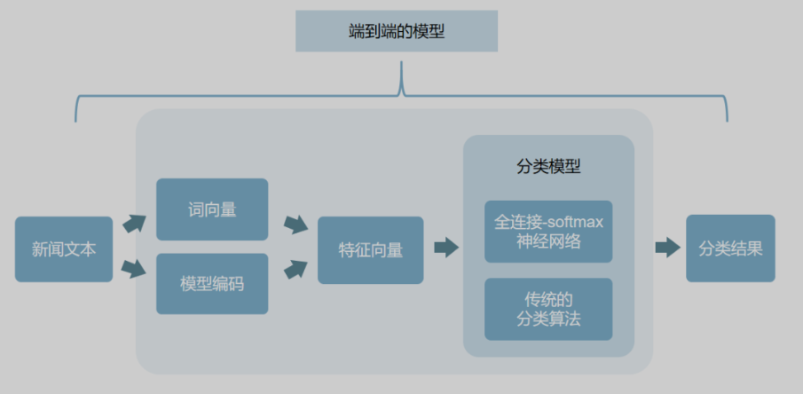

在完成文本特征构建之后，分类任务就变得非常简单了，一般的做法可以是将特征向量传入一个简单的全连接-softmax 神经网络，或者使用传统的分类算法，如支持向量机（SVM）等；

## 2.TextRNN

文章参考：[(12条消息) 总结textRNN_cqu_shuai的博客-CSDN博客](https://blog.csdn.net/beilizhang/article/details/109005461)；

TextRNN指的是利用RNN循环神经网络解决文本分类问题，基于RNN的文本分类模型非常灵活，有多种多样的结构。另外，普通RNN在处理较长文本时会出现梯度消失问题，因此实际上常用LSTM或GRU；

下面展示几种常用的TextRNN结构

> 第一种结构

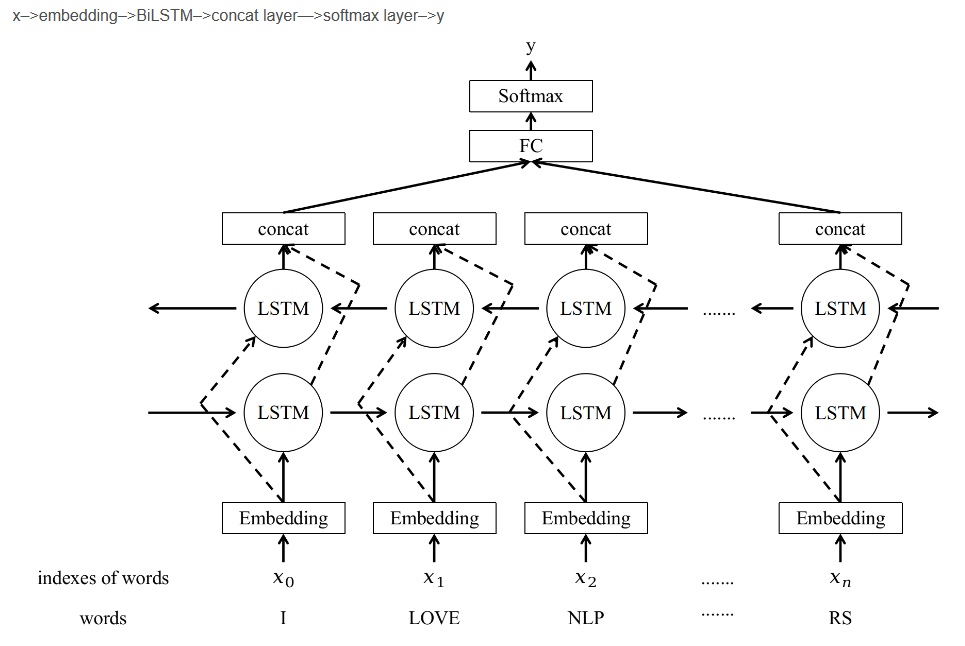

1.单词的embedding可以是随机初始化，也可以使用预训练模型的embedding（如Word2vec、GloVe），后者效果较好。

2.最后拼接初始时间步和最终时间步的隐藏状态作为全连接层输入。

> 第二种结构

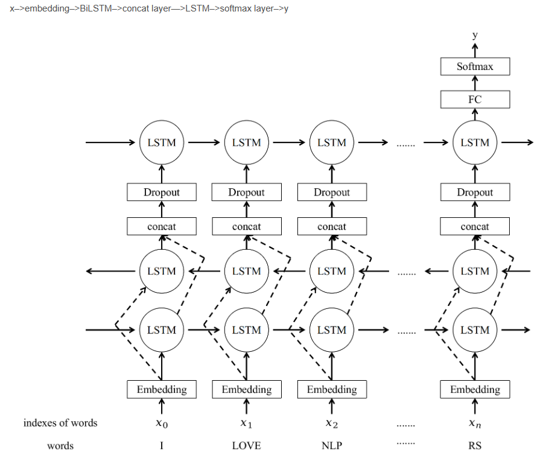

与之前结构不同的是，在双向LSTM的基础上又堆叠了一个单向的LSTM。把双向LSTM在每一个时间步长上的两个隐藏状态进行拼接，作为上层单向LSTM每一个时间步长上的一个输入，最后取上层单向LSTM最后一个时间步长上的隐藏状态，再经过一个softmax层得到分类结果。

## 3.词向量模型

词向量模型相较于其他算法有两点好处：

- 考虑了词之间的顺序关系；
- 考虑了近义词在空间上的表达应当一致；

将文本转换为向量可以计算文本相似度，通常数据的维度越高能提供的信息就越多，从而计算结果的可靠性就更值得信赖，谷歌中词向量维度范围在50~300维度；

词向量模型将词转换为向量，假设现在已经拥有一份训练好的词向量，其中每一个词都表示50维度的向量，在热度图中表示如下


可以发现，相似的词在特征表达中比较相似，这也表明使用这样的词向量表达特征是有意义的；

如何通过神经网络训练得到词向量模型呢？首先要明确神经网络的输入是词序列，输出是预测的词的概率（实际上就是一个多分类任务）；

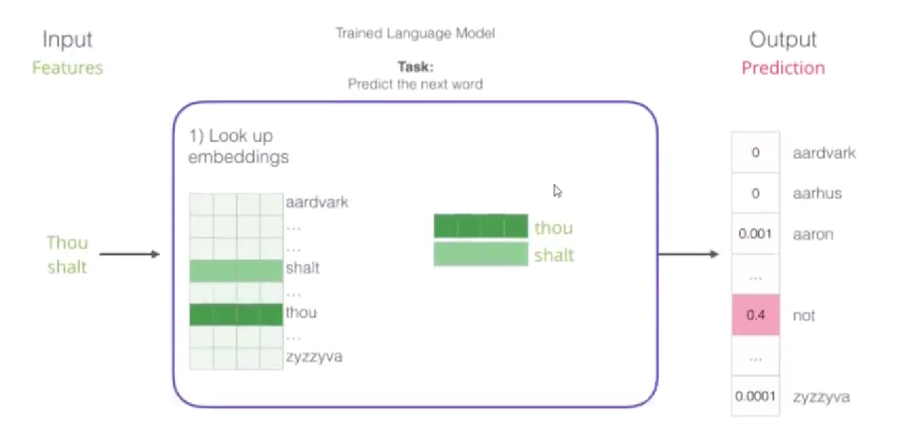

因为文本类型的词无法直接输入神经网络，所以在输入之前需要先作embedding转换为词向量，简单来说就是在词表中查找其对应的向量表示；

-----

> Q：embedding这张词表是怎么来的？需要我们自己训练吗？

A：embedding词表是通过随机初始化之后，经过神经网络的训练，神经网络的前向传播计算loss function，反向传播通过error更新权重参数矩阵，同时也会更新词表中的向量，当神经网络训练到收敛的时候，就得到标准的embedding词表 -- 评价词表的好坏的策略就是，计算机如何表达当前的词可以使得预测的下一个词更加准确；

在普通的领域中我们不需要自己训练embedding词表，可以直接使用Google或者腾讯训练好的embedding词表（因为不同的训练数据中词的含义几乎是相同的）；

------

将输入数据转换为向量后，选择不同架构的模型来进行训练，经典的架构有

> CBOW

输入是上下文，输出是中间的词


> Skipgram

输入是上下文，输出是上下文

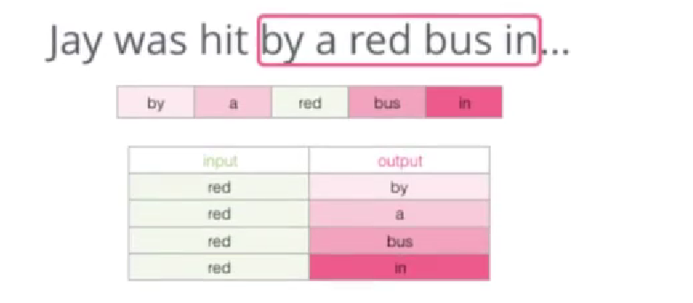

前面说过通过神经网络训练得到词向量模型可以看作是一个多酚类任务，但是当词的个数较多的时候，类别也随之较多，对于神经网络来说计算量极大；

我们将上述多分类任务改进为二分类任务，即将输入改为上下文和待预测词，输出为正确率，为了避免训练集中出现全1的情况，需要加入一些负样本（数量大概为5个）

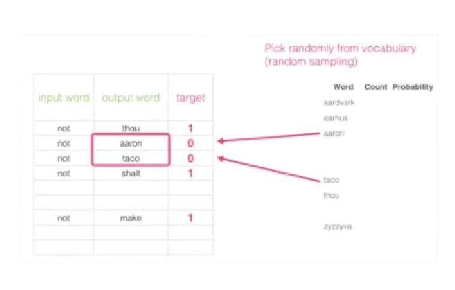

# 二、气象文本分类

## 1.数据集介绍

### 1.1 文本预处理

训练数据集使用的是基于所给的语料库，对其标题进行提取作为文本特征进行训练；

原始数据如下

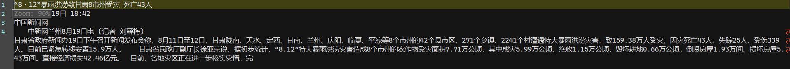

经过观察可以发现，针对气象文本分类，较为有用的特征分别是新闻标题和新闻摘要，因为没有合适的新闻摘要提取方式（此前分别尝试了textrank4zh和snownlp用于提取新闻摘要，但效果都非常差），因此这里我们只选择了新闻标题作为数据进行训练；

如何从语料库中提取新闻标题？经观察发现所有的新闻标题都位于文本首行，因此我们编写如下程序自动提取语料库文本中的标题并添加类别标签，类别标签0-6分别对应：`flood hail waterlogging gale drought thunderbolt typhoon`

```py
#对data目录中的每个文本分别进行特征提取，并将摘要和类别标签放入新文档中
target_file=open('typhoon.txt','w',encoding='utf-8')                                          #汇总结果文件 
#提取data文件夹中所有文件的第一行
datapath = 'D:\My_document\大三下文档\知识图谱\作业\第一次作业\实验1-语料\台风'   
dirs = os.listdir(datapath)           #dirs得到所有txt文件名
for dir in dirs:
    fname = datapath+'\\'+dir
    with open(fname,'r',encoding='utf-8')as src_file:
        lines =src_file.readlines()
        first_line = lines[0] # 取第一行
        print(first_line) 
        handle_sentence = remove_punctuation(first_line)
        target_file.write(handle_sentence+'\t'+'6'+'\n')                                          #类别标签
target_file.close()
```

通过上述程序提取得到的数据形式如下（前面为文本内容，后面为其所属类别）

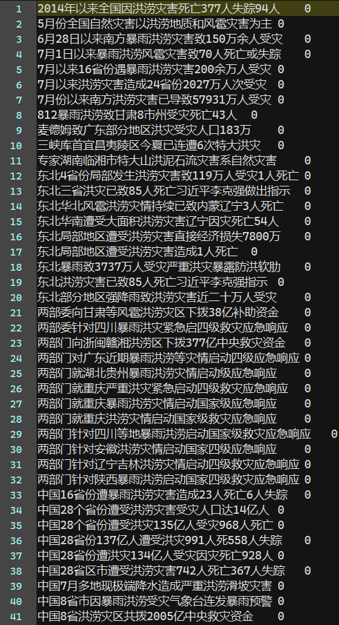

-----

> Q：为什么没有对数据进行分词和去除停用词处理？

A：针对上述我们提取得到的数据，在之后的训练过程中使用的是基于字的embedding，因此无需分词；经观察可知上述数据并未有多少停用词（新闻标题本身就精简），因此无需这一步骤，若实在有必要去除停用词可以参考以下代码，其中的stopwords.txt可以在Github或网上直接搜索“停用词表”得到

```py
#删除停用词
stopwordlist=[]
fencilist=[]
resultlist=[]
 
with open("stopwords.txt",'r',encoding="UTF-8") as f:
    for i in f:
        stopwordlist.append(i)
        
with open("1.txt",'r',encoding="UTF-8") as test:
    for line in test:
        fencilist.append(line.strip())
for i in fencilist:
    if(i not in stopwordlist):
        resultlist.append(i)
with open("result.txt",'w',encoding="UTF-8") as xx:
    for x in resultlist:
        xx.write(x+'\n')
```

当然也可以直接调用gensim库中的函数

```py
from gensim.parsing.preprocessing import remove_stopwords

text = 1.txt
filtered_sentence = remove_stopwords(text)

print(filtered_sentence)
```

-----

### 1.2 数据集划分

经上述预处理得到的数据如下

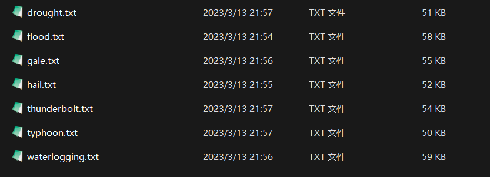

因为数据量本身不大，所以按照训练集:验证集:测试集=18:1:1的比例划分（参考THUCNews数据集划分标准），划分数据集的代码如下

```py
from __future__ import print_function
import os
import random
from shutil import copy2
import sys
import math

#接下来的思想就是将七个文档分别按照比例拆分后追加到同一个文档中
#按行读取名为orginal.txt的txt文件，存入data
data = []
for line in open("D:/My_code/jupyter notebook/大三下作业/knowledge graph/src_data/typhoon.txt","r",encoding='utf-8'): 
    data.append(line)  #设置文件对象并读取每一行文件，注意文件对象每次需要手动修改
    continue

# 创建一个txt文件生成函数，文件名为name + '.txt',并向文件写入msg
def text_create(name,msg):
    desktop_path = "D:/My_code/jupyter notebook/大三下作业/knowledge graph/target_data/"  # 新创建的txt文件的存放路径
    full_path = desktop_path + name + '.txt'  
    file = open(full_path, 'a') #注意是追加模式
    file.write(msg)   #msg也就是需要追加写入的内容
    file.close()

#向下取整避免文本不够
train_stop = math.floor(len(data)*0.9)
dev_stop = math.floor(len(data)*0.05)
test_stop = math.floor(len(data)*0.05)

for i in range(len(data)):
    if i <= train_stop:
        text_create("train",data[i])
    if train_stop < i <= train_stop+dev_stop:
        text_create("dev",data[i])
    if train_stop+dev_stop < i :
        text_create("test",data[i])
```

为了拟合真实的数据分布，我们需要将划分好的训练集、测试集以及训练集中的数据进行打乱形成如下所示的形式

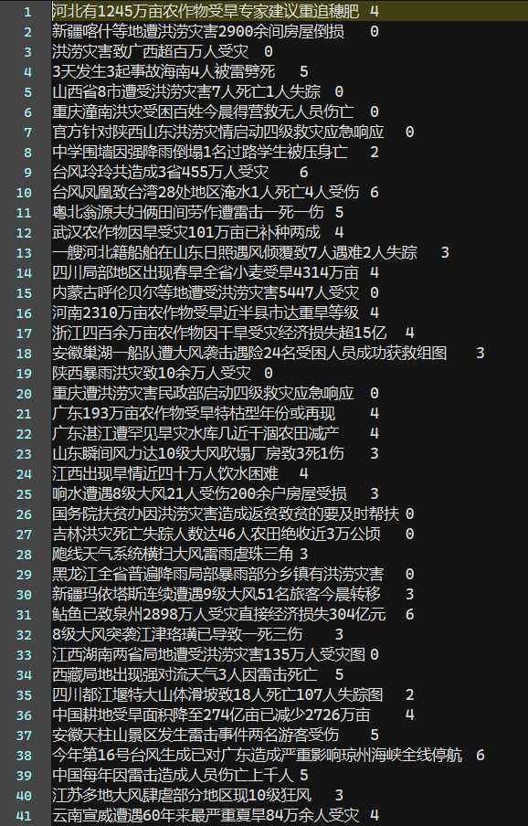

对数据进行shuffle的代码如下

```py
import random
 
out_file = open('./target_data/dev_shuffle.txt','w',encoding='gbk')  #输出文件位置
 
lines = []
 
with open('./target_data/dev.txt', 'r',encoding='gbk') as f:   #需要打乱的原文件位置
    for line in f:  
        lines.append(line)
random.shuffle(lines)
 
for line in lines:
    out_file.write(line)
 
out_file.close()
```

至此，我们得到了训练所需的最终的数据集，其中训练集有23,018条数据，验证集有1,275条数据，测试集有1,278条数据（这个数据是因为把新闻内容和新闻标题都加进去了，实际上只使用新闻标题训练的效果会比使用工具提取出来的摘要的效果要好，因为工具提取出来的摘要的质量烂的没话说），文本长度均在20到30之间，一共7个类别，分别是flood(暴雨洪涝) hail(冰雹) waterlogging(城市内涝) gale(大风) drought(干旱) thunderbolt(雷电) typhoon(台风)；

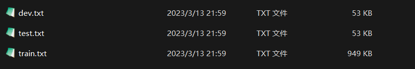

## 2.项目配置

在将文本数据放入RNN神经网络之前需要先将其转换为词向量，同时需要对网络参数、全局参数等进行设置；

### 2.1 项目介绍

本次实验使用的网络模型为TextRNN，使用的预训练词向量模型为搜狗新闻的embedding词表，同时使用了预训练得到的char索引表；

### 2.2 参数配置

配置训练数据的路径、模型保存路径以及网络模型架构、模型训练的超参数等

```py
# 全局参数配置
self.model_name = 'TextRNN'
self.train_path = 'data/train.txt'                                # 训练集
self.dev_path = 'data/dev.txt'                                    # 验证集
self.test_path = 'data/test.txt'                                  # 测试集
self.class_list = [x.strip() for x in open('data/class.txt').readlines()]  # 类别名单
self.save_path = 'model/' + self.model_name + '.ckpt'               # 模型训练结果
self.device = torch.device('cuda' if torch.cuda.is_available() else 'cpu')    # 设备
self.vocab_path = 'data/vocab.pkl'                                # 词表
self.log_path = 'log/' + self.model_name
self.embedding_pretrained = torch.tensor(np.load('data/embedding_SougouNews.npz')['embeddings'].astype('float32'))
# 网络模型参数配置
self.dropout = 0.5                                              # 随机失活
self.require_improvement = 1000                                 # 若超过1000batch效果还没提升，则提前结束训练
self.num_classes = len(self.class_list)                         # 类别数
self.num_epochs = 10                                             # epoch数
self.batch_size = 128                                           # mini-batch大小
self.pad_size = 32                                              # 每句话处理成的长度(短填长切)
self.learning_rate = 1e-3                                       # 学习率
self.embed = 300                                                # 字向量维度
self.hidden_size = 128                                          # lstm隐藏层
self.num_layers = 2                                             # lstm层数
```

### 2.3 数据读取

根据配置文件中配置的路径将训练集、验证集和测试集数据读取，并对每条数据分别进行切分、分字、填充/截断和索引操作；

根据vocab.pkl将每个char转换为对应的索引，便于之后在embedding词表按照索引找到对应的词向量；

```py
vocab_dic = {}
with open(file_path, 'r', encoding='utf-8') as f:
    for line in tqdm(f):
        lin = line.strip()
        if not lin:
            continue
        content = lin.split('\t')[0]
        for word in content:
            vocab_dic[word] = vocab_dic.get(word, 0) + 1
    vocab_list = sorted([_ for _ in vocab_dic.items() if _[1] >= min_freq], key=lambda x: x[1], reverse=True)[:max_size]
    vocab_dic = {word_count[0]: idx for idx, word_count in enumerate(vocab_list)}
    vocab_dic.update({UNK: len(vocab_dic), PAD: len(vocab_dic) + 1}) 
return vocab_dic
```

读入txt文本，按照'\t'分隔符将每行的数据分为content和label，content为文本内容，因为需要限制文本的字数，设置的pad_size为32即大于该长度的文本将被截断，小于该长度的文本将被填充未知字，未知字在后面转换为embedding的时候会被转换为相同的词向量；

```py
contents = []
with open(path, 'r', encoding='gbk') as f:
	for line in tqdm(f):
		lin = line.strip()
		if not lin:
			continue
		content, label = lin.split('\t')
		words_line = []
		token = tokenizer(content)
		seq_len = len(token)
		if pad_size:
			if len(token) < pad_size:
				token.extend([vocab.get(PAD)] * (pad_size - len(token)))
			else:
				token = token[:pad_size]
				seq_len = pad_size
		for word in token:
			words_line.append(vocab.get(word, vocab.get(UNK)))
		contents.append((words_line, int(label), seq_len))  # (words, label, seq_len)
return contents
```

### 2.4 模型构建

定义初始化模型的函数，直接调用nn模块中的函数定义embedding层、lstm层以及fc全连接层

```py
super(Model, self).__init__()
self.embedding = nn.Embedding.from_pretrained(config.embedding_pretrained, freeze=False)
self.lstm = nn.LSTM(config.embed, config.hidden_size, config.num_layers, bidirectional=True, batch_first=True, dropout=config.dropout)
self.fc = nn.Linear(config.hidden_size * 2, config.num_classes)
```

借用上述定义的函数定义前向传播

```py
out = self.embedding(x[0])  # x[0]是句子
out, _ = self.lstm(out)
out = torch.mean(out, 1)
out = self.fc(out)
return out
```

## 3.训练/测试

这里训练RNN的方法和传统训练神经网络的方法类似，传入训练参数即训练网络、训练数据、验证数据、测试数据

```py
model.train()   # 调用train函数开始训练
optimizer = torch.optim.Adam(model.parameters(), lr=config.learning_rate)  # 定义优化器，此处的优化器为Adam，可以更改为其他优化器
total_batch = 0  # 记录进行到多少batch
dev_best_loss = float('inf')   # 定义loss，初始为无穷，在训练过程中迭代更新
last_improve = 0  # 记录上次验证集loss下降的batch数
flag = False  # 记录是否很久没有效果提升
```

项目设置了一共10个epoch，每个epoch对多个batch进行训练

```py
for epoch in range(config.num_epochs):
	print('Epoch [{}/{}]'.format(epoch + 1, config.num_epochs))
	for i, (trains, labels) in enumerate(train_iter):
		outputs = model(trains) # 输出output
		model.zero_grad()
		loss = F.cross_entropy(outputs, labels)  # 误差loss
		loss.backward()	# 误差反向传播
		optimizer.step() # 优化器及逆行优化
		if total_batch % 100 == 0: # 每多少轮输出在训练集和验证集上的效果
			true = labels.data.cpu()	# 真实结果，即labels
			predic = torch.max(outputs.data, 1)[1].cpu() # 预测结果
			train_acc = metrics.accuracy_score(true, predic) # 训练集的准确率
			dev_acc, dev_loss = evaluate(model, dev_iter, config) # 测试集的准确率和loss
			if dev_loss < dev_best_loss:  # 如果在测试集上的loss小于之前记录的最小loss，则更新并保存此次的model
				dev_best_loss = dev_loss
				torch.save(model.state_dict(), config.save_path)
				improve = '*'
				last_improve = total_batch
			else:
				improve = ''
```

当验证集的loss长时间未更新时，表示模型几乎收敛，可以提前结束训练

```py
if total_batch - last_improve > config.require_improvement:
	flag = True
	break
```

训练完成的模型将用于测试，测试阶段需要设置model.eval，即评估模式，在评估模式下，batchNorm层，dropout层等用于优化训练而添加的网络层会被关闭，从而使得评估时不会发生偏移；

测试需要先导入训练好的模型，接着调用evaluate对参数进行评估

```py
model.load_state_dict(torch.load(config.save_path))
model.eval()
start_time = time.time()
test_acc, test_loss, test_report, test_confusion = evaluate(model, test_iter, config, test=True)
```

evaluate是训练模块和测试模块用于评估真实labels和预测labels之间的差异的函数，特别的，当测试模块调用evaluate函数时，会额外输出所有类别的预测结果以及混淆矩阵

```py
report = metrics.classification_report(labels_all, predict_all, target_names=config.class_list, digits=4)
confusion = metrics.confusion_matrix(labels_all, predict_all)
return acc, loss_total / len(data_iter), report, confusion
```

## 4.实验结果

先简单介绍一下实验结果中的一些评价指标；

混淆矩阵confusion matrix，相对来说是最直观的一个评价指标，用n行n列的矩阵形式来表示；混淆矩阵的每一列代表了预测类别，每一列的总数表示预测为该类别的数据的数目；每一行代表了数据的真实归属类别，每一行的数据总数表示该类别的数据实例的数目，每一列中的数值表示真实数据被预测为该类的数目；

精确率(Presicion)表示正确预测为正类的占全部预测为正类的的比例，精确率针对预测结果而言，表示的是预测为正类的样本中有多少是真正的正类样本；

召回率(Recall)表示正确预测为正类的占全部实际为正类的的比例，召回率针对原始样本而言，表示的是全体样本中的所有正类样本有多少被预测正确了；

对于精确率和召唤率，其实就是分母不同，一个分母是预测为正类的样本数，另一个是原始样本中所有的正类样本数；

f1分数同时兼顾了分类模型的精确率和召回率，可以看作是精确率和召回率的调和平均，其取值范围为[0,1]；

宏平均(macro avg)指的是对每个类别的 精准、召回和F1 加和求平均；

加权平均(weighted avg)是对宏平均的一种改进，考虑了每个类别样本数量在总样本中占比；

### 4.1 失败案例

一开始我们对数据的清洗工作做的不够好，导致训练效果非常差，使用的训练数据部分如下

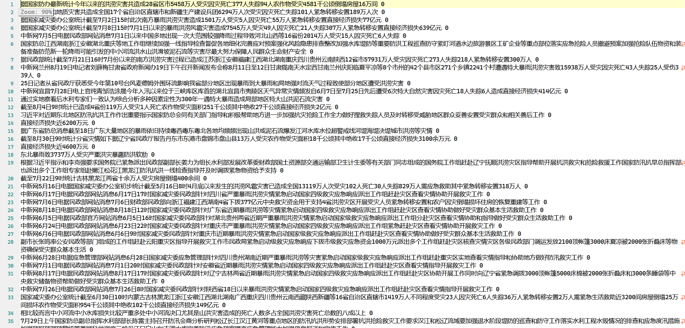

即借助snownlp库以及textrank4zh库分别对新闻正文提取摘要作为训练数据，但问题在于提取的新闻摘要并不能很好的概括新闻内容，这将导致模型的训练结果非常差，同时大部分摘要的文本长度非常长，如果使用这类文本进行训练会给模型带来极大的运算量；

使用上述训练数据进行训练的结果如下，分别进行了两次实验，两次实验的数据集大小不同，但得到的实验结果都非常差经，下图是第一次训练的结果

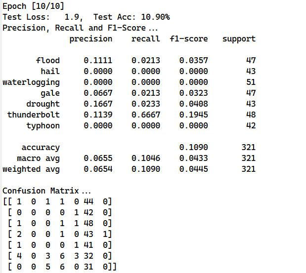

混淆矩阵表明训练结果全部被分为同一类，在网上查询相关资料后认为是训练数据量不够，因此增加了数据量（具体做法就是对部分新闻内容的重要句子提取两次，将这两个句子都作为训练数据），增加数据量后的结果如下

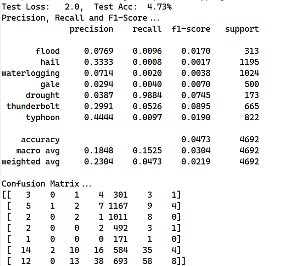

可以看到混淆矩阵中显示仍然是将大量的数据都分类为第五类，增加数据量并不能解决问题，经过反思后确认是数据集本身存在问题，模型并不能学到很好的效果（即使是给它大量数据），经过整理最终得到的训练数据部分如下

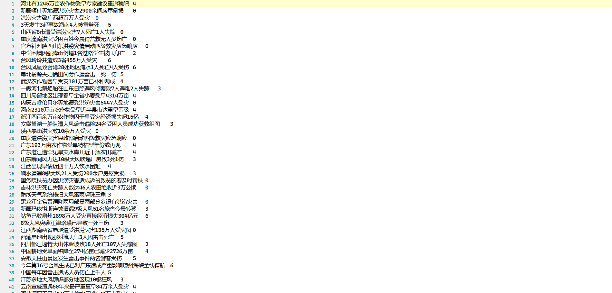

使用形如上述的数据进行训练得到了非常好的结果

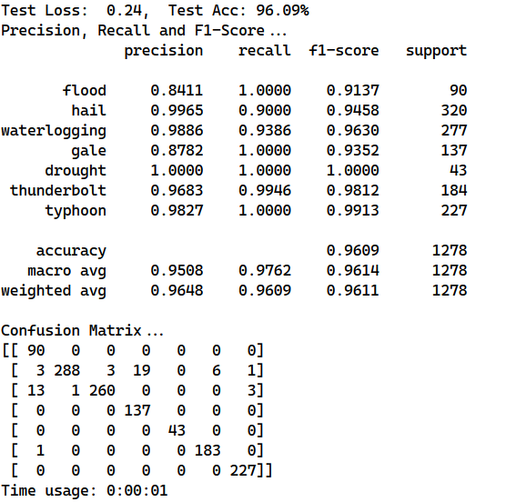

最终对测试集中的数据进行分类的结果几乎正确，但因为训练数据集的大小不是特别大，因此有过拟合的现象存在；

### 4.2 单向LSTM

双向LSTM和单向LSTM的主要区别在于双向LSTM不仅考察了前面的信息，也考察了后面的信息，在某些任务中双向LSTM表现要比单向LSTM要好，我们调整了网络结构，最终使用单向LSTM对新闻文本进行分类

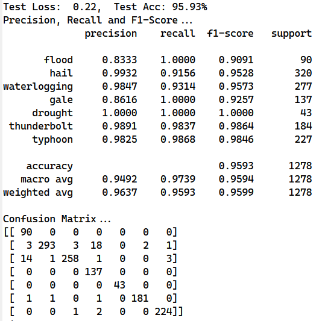

我们这个实验结果并不能很好的表明单向LSTM和双向LSTM的优劣（猜测还是数据量太小了），但有一点很容易看出来，这是双向LSTM的训练时间

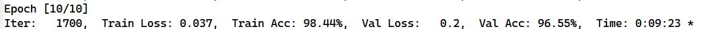

这是单向LSTM的训练时间

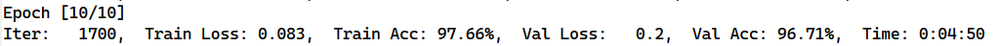

因为双向LSTM的输入序列第一个是输入序列的原样本，第二个是输入序列的反转样本，这就导致训练时间较长；

### 4.3 正则化

dropout作为防止神经网络过拟合的正则化器，其效果有目共睹，我们设置了dropout为0即关闭dropout正则化器，得到了如下实验结果

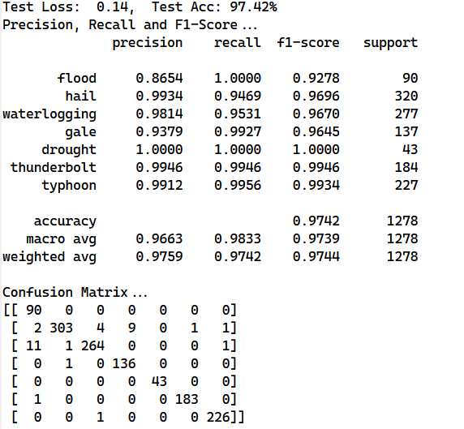

可以看到关闭dropout之后的结果略好于开启dropout，这表明减少了正则化参数之后对最终结果有一定提升作用，这也表明dropout不一定有用，需要根据实际任务进行选择；

### 4.4 多层LSTM

因为双向LSTM的特性，为了减少训练时间所以一开始只设置了2层的LSTM层，尝试增加LSTM的层数是否能提高训练效果

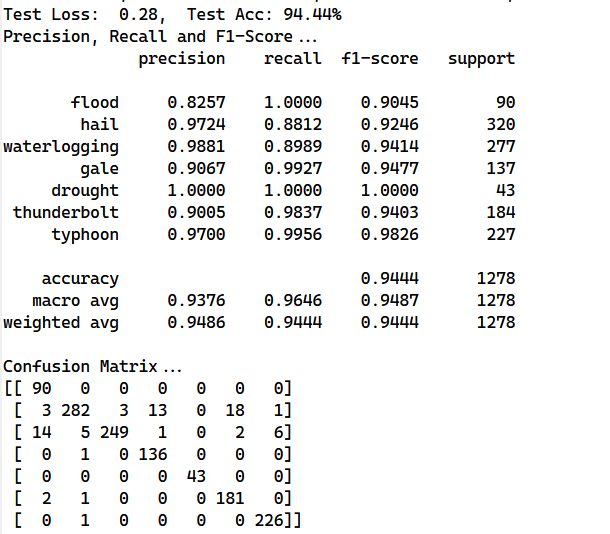

结果出乎意料，直观的感受应该是增加了网络层数是可以提升训练效果的，但是效果并不好，其中一个原因是因为数据量太小导致过拟合的现象

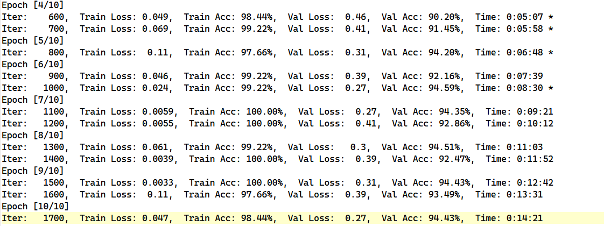

当模型的学习能力足够强的时候能够在训练数据集上得到很好的效果，但是因为其泛化能力不够所以在验证集和测试集的效果略差，解决过拟合的主要方法有降低模型复杂度（将模型层数降为2层）、增加训练集数据、数据增强以及正则化等；

### 4.5 word训练

前面都是基于字char的训练，考虑基于词word进行训练，对字来说其可能性较小，而词的组合非常多，如果直接使用字的embedding对word进行训练会得到下面的结果

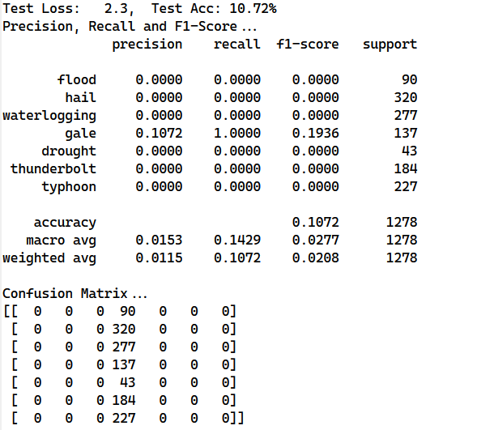

效果非常差，需要自行训练词的embedding表或使用现有的词嵌入表对word进行转换；

### 4.6 结果可视化

利用tensorboard工具可以对训练结果进行可视化表现，使用

```shell
tensorboard --logdir=xxxx
```

对文件夹中的日志文件进行可视化，在浏览器中打开http://localhost:6006/可访问tensorboard的页面（这里展示的是使用3层LSTM对应的验证集和测试集的准确率图像）

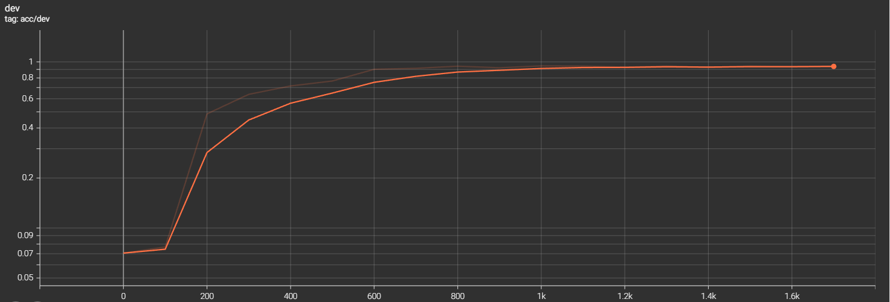

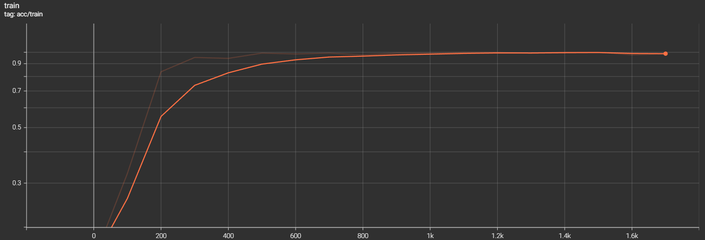

可以看到在训练集上的准确率在step为1k的时候就接近99%，更是在step为1.1k的时候准确律达到1，这是典型的过拟合现象；

## 5.实验总结

本次实验基于给定的中文语料库，利用RNN循环神经网络对中文气象灾情文本进行了分类，在完整该实验的过程中我学习到了文本分类的基本流程以及RNN的基本工作原理，同时了解了数据集划分的标准以及手动对模型的超参数进行调整以观察实验现象；在这个过程中我遇到了许多问题，在查阅了大量资料后成功解决，在一次次的尝试过后得到了较为干净的数据集，并通过将代码上传至Kaggle利用其GPU进行模型训练，同时了解并手动调整模型超参数进行多次实验得到不同的实验结果，对实验结果进行分析，了解不同实验结果背后的原因，进一步掌握机器学习的基本方法。